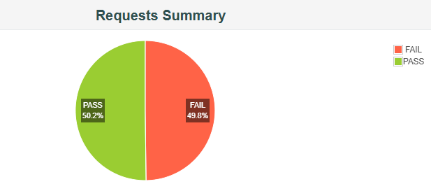
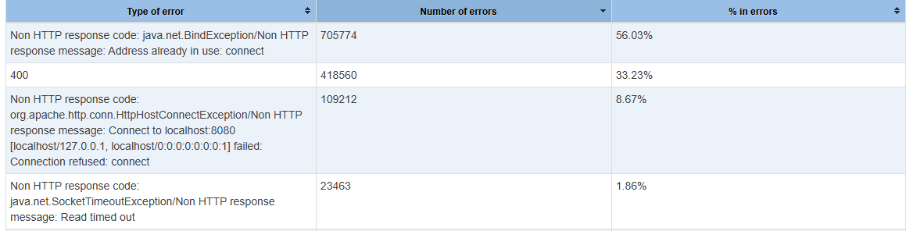

# TransactionServer
Demo project showcasing the capabilities of Gentian Licenji as a Senior Software Engineer.
<br/>A robust enterprise-grade financial transaction processing service built with Spring Boot, implementing secure account operations and transaction management.
<br/>The system features a RESTful API architecture with HMAC-based authentication, comprehensive error handling, and strict transaction validation protocols.
## Project overview
The following is the project structure to be expected:
```markdown
📁 main
├── 📁 java
│   └── 📁 server
│       ├── 📁 config
│       │   ├── ApiKeyProperties
│       │   ├── SecurityConfig
│       │   └── SwaggerConfig
│       │
│       ├── 📁 controller
│       │   └── TransactionController
│       │
│       ├── 📁 delegate
│       │   └── TransactionDelegate
│       │
│       ├── 📁 exception
│       │   ├── AccountNotFoundException
│       │   ├── AuthException
│       │   └── GlobalExceptionHandler
│       │
│       ├── 📁 filter
│       │   ├── AuthenticationFilter
│       │   └── LoggingFilter
│       │
│       ├── 📁 model
│       │   ├── 📁 api
│       │   │   ├── TransactionRequest
│       │   │   └── TransactionResponse
│       │   ├── 📁 db
│       │   │   ├── AccountEntity
│       │   │   └── TransactionEntity
│       │   └── 📁 rest
│       │       └── ErrorResponse
│       │
│       ├── 📁 repository
│       │   ├── AccountRepository
│       │   └── TransactionRepository
│       │
│       ├── 📁 service
│       │   └── TransactionApiService
│       │
│       ├── 📁 util
│       │   ├── AuthUtil
│       │   ├── ErrorCode
│       │   └── 📁 filter
│       │       └── CustomRequestWrapper
│       │
│       └── AppStarter
```

Key components:
- 🔒 `config`: Application configurations
- 🎮 `controller`: API endpoints
- 🎯 `delegate`: Business logic delegation
- ⚠️ `exception`: Error handling
- 🔍 `filter`: Request/Response processing
- 📝 `model`: Data structures
- 💾 `repository`: Data access
- ⚙️ `service`: Business logic
- 🛠️ `util`: Helper classes

### Work breakdown
During an approximate seven days (56 hours) of work, the following major tickets were completed:
* [SISAL-01]: Initial project setup + Documentation
* [SISAL-02]: Unit testing
* [SISAL-03]: DB connectivity and repository setup
* [SISAL-04]: Authentication Implementation
* [SISAL-05]: Exception handling / Logging / Validation
* [SISAL-06]: Swagger UI setup / Swagger Code Generation.
* [SISAL-07]: BugFixing: Transaction API service data flow.
* [SISAL-08]: Load Testing with JMeter.

## How to set up?
Quick guide to get started on the project.
### 0. Required Software 🛠
```markdown
* Java 8 or higher
* Maven 3.6+
* Git
* Docker (optional, for containerization)
* Kubernetes (optional, for orchestration)
```
### 1. Clone repository
git clone [repository-url]

### 2. IDE Setup 💻
```markdown
* Install Lombok plugin
* Enable annotation processing
* Import as a Maven project
* Set Java 8 as SDK
```
### 3. Database 📊
Please see the [DB Setup README](./DBSetup.md) on setup details.

## How to run as embedded?
0. **Build all required artifacts**: 
<br/>Note: None required for this demo project
    ```bash
    mvn clean install
    ```
1. Go inside project repo.
    ```shell
    cd TransactionSpringBoot
    ```
2. Build the server jar by executing
    ```shell
    mvn clean package
    ```
3. Run the server jar by executing
    ```shell
    mvn spring-boot:run
    ```
## How to test?

### 1. Health Check 🏥
```bash
# Browser
http://localhost:8080/actuator/health

# or curl
curl -i http://localhost:8080/actuator/health
```

### 2. Curl Commands 📟
  ```bash
  # Set variables
  TIMESTAMP=$(date +%s000)
  API_KEY="8x7HHSG2J5ns9LzN3k4m6P5Q"
  HMAC=$(echo -n "${API_KEY}${TIMESTAMP}{\"accountNumber\":\"GB29NWBK60161331926819\",\"transactionType\":\"DEPOSIT\",\"amount\":1000.00}" | \
  openssl dgst -sha256 -hmac "bK7dF9qW2pR5vT8xL4mN3jH6cU9wY1aE" | cut -d' ' -f2)
  
  # Make request
  curl -i -X POST http://localhost:8080/api/transactions \
    -H "Content-Type: application/json" \
    -H "X-API-Key: ${API_KEY}" \
    -H "X-Timestamp: ${TIMESTAMP}" \
    -H "X-HMAC-Signature: ${HMAC}" \
    -d '{"accountNumber":"GB29NWBK60161331926819","transactionType":"DEPOSIT","amount":1000.00}'
  ```

### 3. Postman 🚀
1. Import [collection](api-docs/postman-test-suite.json)
2. Environment variables set automatically via pre-request script
3. Run requests:
  * Success case (DEPOSIT)
  * Invalid amount (>10000)
  * Invalid type

### 4. Integration Tests🧪
Run all tests
    ```bash
    ./mvnw test
    ```
Run the main end-to-end test class
```bash
./mvnw test -Dtest=TransactionAPIE2ETest
```
## OpenAPI (Swagger)—RESTful API specification
### Automated API changes - Swagger Codegen
All api changes and definitions are captured through [OpenAPI Specification (OAS) standard](https://swagger.io/specification/).
<br/>Transaction Server utilizes [swagger codegen library](https://github.com/swagger-api/swagger-codegen) to generate code based on this spec.
<br/>This generator can be used to create controller and model classes, which reduce the code changes required when changing a Rest Api spec.
<br/>The overall project structure shows which components will be auto-generated:
```
|-- src
|   `-- main
|       |-- java
|       |   `-- com.sisal.transaction.server
|       |               |-- controller (generated with custom swagger codegen - contains spring & springfox annotations)
|       |               |-- filter
|       |               |-- delegate
|       |               |-- service
|       |               |-- config
|       |               |-- exception
|       |               |-- model (generated with custom swagger codegen)
|       |               `-- util
|       `-- resources
```
***NOTE***
<br/> I have extensive experience using Swagger (now OpenAPI).
<br/> During my time at ScotiaBank, I served as the sole contributor to an open-source extension of Swagger Codegen.
<br/> My work involved creating custom mustache templates to support multiple use cases across North and South America, as well as enhancing internal libraries built on top of the Spring Framework.
<br/>For this project, I'm leveraging my own private, customized solution I developed based on Swagger Codegen to ensure robust integration and functionality.
<br/>This will ensure fast and easy API updates to the codebase straight from the spec changes.

### Swagger UI - Spring Fox
To view the swagger spec in the browser, go on localhost:8080/swagger-ui/.
<br>TODO: currently this is bugged due to the auth filter setup.
Needs more time for investigation.
### API Updates
To perform api updates through the code base, please run maven build with codegen profile:
    ```bash
    mvn clean package -P codegen
    ```

## Design Decisions and Best Practices
### Architecture Overview
Good design patterns that are followed:
* Model View Controller pattern (Provides intuitive method based annotation to define a url mapping)
* Dependency Injection pattern. (Promotes decoupling with singletons and bean auto-wiring)
* Front Controller design pattern (Provides centralized logging/authentication/validation/exception-handling)

### Logging
#### 1.Custom Request/Response Logging
Our logging implementation provides comprehensive request/response tracking while ensuring sensitive data protection. The solution revolves around a custom logging filter that captures HTTP interactions, paired with a global masking mechanism for sensitive information.
By disabling Spring's default web logging, we maintain full control over log output and format. This approach eliminates duplicate logging while ensuring consistent log structure and content across the application.

#### 2.Data Privacy & Masking
The logging system incorporates a global masking converter that automatically identifies and masks sensitive information before it reaches log files. This ensures compliance with data protection requirements while maintaining useful logging information for debugging and monitoring.

Key masked elements include:
- Account numbers
- Personal identifiers
- Security credentials
- Authentication tokens

This approach provides a balance between detailed system logging and data privacy requirements, ensuring comprehensive system monitoring without compromising sensitive information.
### Authentication mechanism
#### 1.HMAC-Based API Security

Our authentication implementation uses a Hash-based Message Authentication Code (HMAC) approach, providing robust API security while maintaining high performance. This solution ensures request authenticity, prevents tampering, and protects against replay attacks.

#### 2.Key Security Features

The authentication mechanism validates three critical parts:
- API key for client identification
- Timestamp to prevent replay attacks
- HMAC signature ensuring request integrity

A 30-minute timestamp window prevents replay attacks while allowing for reasonable clock skew between client and server systems.

#### 3.Spring Security Integration

The solution seamlessly integrates with Spring Security's infrastructure, enabling role-based access control and security context propagation. By extending Spring Security's filter chain, we maintain standard security patterns while implementing custom authentication logic.

This approach provides enterprise-grade API security while remaining lightweight and performant, suitable for high-throughput API environments.

### Validation 
Like all other cross-cutting concerns, this feature has been standardized as well.
I let validation be applied by the swagger spec itself through jackson annotation and out-of-the-box spring validator.
Validation happens during HTTP message conversion before reaching the controller method.
<br/>Some rare business cases might call for creating a custom validator for complex business rules. 
<br/>It is recommended to implement these as HandlerInterceptors for the following reasons:
- Access to handler method information
- Spring context fully available
- Better for business validation logic
- More integration with Spring MVC
- Runs after request mapping

### Exception Handling
I am a firm believer in pushing error handling and validation on the outside boundaries of the application.
<br/> For this reason I do not apply null checks, and try catch blocks within the application logic layers.
<br/> Of course, there are exceptions to be made on exception handling. Pun intended. 😄

[GlobalExceptionHandler](src/main/java/com/sisal/transaction/server/exception/GlobalExceptionHandler.java)
<br/>I am using out-of-the-box @ControllerAdvice from spring that acts inside the application context.
<br/>The custom exceptions thrown by the business layer contain application errors and are handled in a centralized manner
<br/>I also extended ResponseEntityExceptionHandler to override more exception scenarios and obfuscate error details.
<br/>This will increase application security since we reveal minimal information over REST.

[AuthenticationFilter](src/main/java/com/sisal/transaction/server/filter/AuthenticationFilter.java)
<br/>On the other hand, the custom authentication exceptions won't be caught by the GlobalExceptionHandler
because filters operate outside of Spring's DispatcherServlet context.
<br/>As a result, the error responses are handled manually inside the filter.
<br/>Note: A centralized exception handling filter can be defined to catch all java native (Servlet API) errors.

### Object Mapping 
MapStruct vs Lombok vs Fluid API setters
<br/> I would try to avoid lombok because annotation processing needs to be enabled in certain IDEs and does not improve readability by using the classic setter getters when called.
<br/> I would opt out for the Fluid api setters using pure java code. It is also the common choice when generating java models in Swagger/OpenAPI.
<br/> I would use mapstruct for complex model mappings that require a lot of code manipulation as it simplifies the whole process and saves time.

### Application properties
All sensitive properties like username passwords will be setup as kubernetes secrets in a cloud deployment environment.
<br/>Depending on the cloud provider, they would be linked with specific solutions
(HashiCorp Vault, AWS secret manager,Azure Key Vault,Google Cloud Secret Manager etc.)
<br/> Sensitive data can also be managed by jenkins pipeline for an on-prem solution,
and they can be injected during deployment using custom scripts.

For multi-tenant and multi-cluster complex deployments, I would highly recommend
applying Helm charts to manage the different configurations.

### Business Requirements—Implementation Ideas
A small section on the way to implement the business requirements mentioned.
#### Transaction count limit (Rate Limiting)
I implemented this transaction management requirement by using spring data jpa queries. 
<br/>This is great for a single instance that requires exact transaction count,
but can be computationally intensive and can cause transaction locking in high concurrency scenarios.
<br/> Transaction and account locking are necessary to prevent race conditions during updates.

<br/>The Redis Cluster Cache approach is the best solution for rate limiting in because:
- It's more accurate in a distributed environment
- It automatically handles the sliding window
- It's more efficient than database queries
- It automatically cleans up after the minute expires

#### Maximum transaction amount
This is done automatically as a rest requirement on the spec. Jackson validation through annotation is set up for this.
#### Minimum-account balance
This is set up as an SQL constraint at the database level through the table SQL schema. 
<br/>It is also as business logic in the TransactionApiService, but can be removed as redundant.
## Database Choice
### Preface
During my 8 years of experience in the fintech space, relational databases were the mandatory choice.
<br/>Here are some reasons:
* ACID Transactions (ensures data integrity)
* Enforce data constraints (ability to combine validation with the business layer by using transaction-bound queries or checks)
* SQL Queries are a powerful tool for Reporting and Auditing
* Maturity and Ecosystem:
    * PostgreSQL and MySQL have robust support with Spring Data and JPA/Hibernate, making them straightforward to set up and use.
    * They offer mature tooling for migrations (Flyway or Liquibase), monitoring, backups, and replication.

When deciding database solutions, there are a few factors that I take into account:
* Client-specific requirements (In this case, I don't have any functional requirements outlined on scale/performance/budget/analytics)
* Adoption and maintenance cost (Critical in most companies)
* Team skill-set (Team skill and familiarity play a big role especially in smaller companies/ startups)
* Company adoption (Usually there are one or two main solutions that are implemented company-wide)
* Industry adoption (Typically I try to select industry-wide adopted tools that have a proven track record along years)

### PostgreSQL Vs MySQL Vs Microsoft SQL Server Vs Oracle Database
(Source:ChatGPT - O1)
* PostgreSQL:
  * Rich Feature Set and Standards Compliance: Adheres closely to SQL standards, offering advanced SQL features such as window functions, CTEs, and JSONB.
  * Ideal for Complex Queries and Analytics: Superior query optimizer and support for complex operations make it well-suited for transactional and analytical workloads.
* MySQL:
  * Simpler Read-Heavy Workloads: Known for good performance on straightforward read-intensive applications.
  * Widespread Adoption and Tooling: Has a massive user base, extensive documentation, and a variety of external tools for setup, maintenance, and scaling.
* Oracle Database or Microsoft SQL Server:
  * Feature-rich and great performance, but typically come with steep licensing costs and, in many cases, higher operational overhead.
  * They’re often used in large enterprises that need specific features or already have an ecosystem built around these databases and can justify the associated cost.
* SQLite:
  * Extremely lightweight but not ideal for concurrent usage at scale or where advanced SQL queries and high transaction throughput are needed.
  * Typically used for prototyping, small-scale applications, or embedded scenarios.

### DB final decision
I will be using a Microsoft SQL database for main functionality due to the familiarity with the tool and the requirements presented.
<br/> I will be using an H2 database for integration and unit testing due to ease of use.
<br/> Below is the project setup for the databases used:
```
src/
├── main/
│   ├── java/
│   └── resources/
│       └── application.properties  (SQL Server config)
└── test/
    ├── java/
    └── resources/
        └── application-test.properties  (H2 config)
```

## Third-party library usage.
This Section explains the reasoning behind selecting various libraries.

### Spring boot versioning decision
Due to the project requirement to use java 8 or above, 
<br/>I was constrained to use an older version of Spring Boot (Spring Boot 2.7.x will be supported until August 2024).
<br/>Despite development and setup being easier with newer spring boot versions by using Spring Initializr,
I chose to go the harder path.
Also, in my personal experience, financial institutions are hard to adapt to newer technological advancement.

### MapStruct vs other mapping libraries
(Source:Claude 3.5 Sonnet)

**Advantages**:
* Compile-time Validation
* Superior Performance
* Clear Error Messages
* Developer-Friendly

**Limitations**:
* Setup Requirements
* Learning Curve

**Performance Metrics**
```
MapStruct:    ~25,000,000 ops/sec
Manual:       ~24,000,000 ops/sec
ModelMapper:  ~500,000 ops/sec
Dozer:        ~100,000 ops/sec
```

### SpringFox vs SpringDoc
SpringDoc is the new team, where old members from SpringFox moved to. 
<br/>There are similar political reasons with what happened with Swagger and OpenAPI standard.
<br/>Due to the project requirement to use swagger and the adoption rate I selected the old version of swagger 2.0.

<p> Here's some more details on the Timeline & Evolution:
<br/> (Source:Claude 3.5 Sonnet)

* 2010-2011: Swagger Created
  - Originally developed by Wordnik
  - First major API documentation tool
  - Became very popular in API development

* 2015: SmartBear Acquisition
  - SmartBear acquired Swagger
  - Continued development under SmartBear

* 2016: OpenAPI Initiative (OAI)
  - Swagger Specification was donated to Linux Foundation
  - Renamed to OpenAPI Specification (OAS)
  - Became vendor-neutral standard

* Current State:
  - Swagger = SmartBear's toolset (SwaggerUI, Swagger Editor, etc.)
  - OpenAPI = The specification standard
  - OpenAPI 3.0+ = Current specification version

* Use SpringDoc for:
  - New projects
  - Spring Boot 2.6+
  - Need for OpenAPI 3.0
  - Active maintenance

* Use Springfox only if:
  - Legacy projects
  - Specific requirement for Swagger 2.0
  - Cannot upgrade existing codebase

### Spring Boot DevTools Features
(Source:Claude 3.5 Sonnet)
<br/>Here's a concise breakdown of Spring Boot DevTools

**Benefits**:
* Restarts application when classpath changes (faster than manual restart)
* Browser auto-refresh when changes detected
* Development-friendly property defaults
* Disables template caching
* Enables debug logging
* H2 console enabled
* Remote debugging support
* Enhanced error pages
* Detailed error messages

**Limitations**:
* Not for production use
* Memory overhead
* Potential security risks
* Performance impact

## Contributing
This is a product of © Sisal.
<br/>Developers:
Gentian Licenji

## License
No Licenses.

## Project status
Deadline - Feb 21st,2025.
<br/> Project was completed by Feb 25th,2025.
<br/> Project is being enhanced and updated with no fixed timeline.

## Appendix: BEAST Mode (Benchmark Evaluation And Stress Testing Mode)" 🦁
I disabled the rate limiting service and created a performance test suite for transactions API.
<br/>Due to heavy load testing, I disabled all loggers and set root logger to error only.
<br/>This optimizes the application for performance.

### JMeter Load Testing—Phase 1 (default spring boot configurations)
(Source:Claude 3.5 Sonnet)
<br/>I'll break down the default settings for both REST and JPA/Hibernate in Spring Boot 2.7.18:
**REST Controller Default Settings:**

**REST Controller Default Settings: Embedded Server (Tomcat):**
- Max threads: 200
- Min spare threads: 10
- Connection timeout: 20000ms (20 seconds)
- Max connections: 10000
- Accept count: 100

**JPA/Hibernate Default Settings:**

1. Connection Pool (HikariCP):
- Maximum pool size: 10
- Minimum idle: 10
- Idle timeout: 600000ms (10 minutes)
- Connection timeout: 30000ms (30 seconds)
- Max lifetime: 1800000ms (30 minutes)

2. Hibernate Properties:
```properties
spring.jpa.hibernate.ddl-auto=create-drop
spring.jpa.show-sql=false
spring.jpa.open-in-view=true
spring.jpa.hibernate.naming.physical-strategy=org.springframework.boot.orm.jpa.hibernate.SpringPhysicalNamingStrategy
spring.jpa.hibernate.naming.implicit-strategy=org.springframework.boot.orm.jpa.hibernate.SpringImplicitNamingStrategy
```

3. Transaction Management:
- Default transaction timeout: none
- Default propagation: REQUIRED
- Default isolation: DEFAULT (database default)

4. JPA Properties:
```properties
spring.jpa.properties.hibernate.dialect: auto-detected based on database
spring.jpa.properties.hibernate.format_sql=false
spring.jpa.properties.hibernate.generate_statistics=false
spring.jpa.properties.hibernate.jdbc.batch_size=none
spring.jpa.properties.hibernate.jdbc.fetch_size=none
```

To monitor these settings and get statistics:

1. For REST Controllers:
- Enable Spring Boot Actuator for detailed metrics
- Key metrics available at:
  * /actuator/metrics/http.server.requests
  * /actuator/metrics/tomcat.threads.current
  * /actuator/metrics/tomcat.threads.busy

2. For JPA/Hibernate:
- Enable statistics:
```properties
spring.jpa.properties.hibernate.generate_statistics=true
logging.level.org.hibernate.stat=debug
```
- Enable SQL logging:
```properties
spring.jpa.show-sql=true
spring.jpa.properties.hibernate.format_sql=true
```

### First Test—Phase 1 (1k Requests/second)
Load tested with 1000 requests/second and four different bank accounts.
<br/>The Server was able to process 250 req/seconds on average.
<br/>Here are my interesting performance issues:
<br/>
<br/>The biggest issue is the OptimisticLockingFailure on account db table.

### Second Test—Phase 1 (100k Requests/second)
Load tested with 100k requests/second and four different bank accounts.
<br/>The Server was able to process 950 req/seconds on average.
<br/>Here are my interesting performance issues:
<br/>
<br/>Top issues are related to the rest connection listeners:
<br/>

### Aggressive optimization suggestions—Phase 2 (Theory)
(Source:Claude 3.5 Sonnet)

<br/>For handling 100K requests/second on a single instance, you'll need aggressive optimization at multiple levels.
<br/>Here's a comprehensive approach:

1. JVM Tuning
```bash
JAVA_OPTS="\
 -Xms4g -Xmx4g \
 -XX:+UseG1GC \
 -XX:MaxGCPauseMillis=100 \
 -XX:+ParallelRefProcEnabled \
 -XX:+UseStringDeduplication \
 -XX:+UseNUMA \
 -XX:+UseCompressedOops"
```

2. Server Configuration
```properties
# Tomcat optimization
server.tomcat.threads.max=1000
server.tomcat.threads.min-spare=100
server.tomcat.max-connections=20000
server.tomcat.accept-count=1000
server.tomcat.max-keep-alive-requests=10000
server.tomcat.connection-timeout=2000

# Enable compression
server.compression.enabled=true
server.compression.min-response-size=1024
```

3. Database Optimization
```properties
# HikariCP settings
spring.datasource.hikari.maximum-pool-size=100
spring.datasource.hikari.minimum-idle=50
spring.datasource.hikari.connection-timeout=2000
spring.datasource.hikari.idle-timeout=300000
spring.datasource.hikari.max-lifetime=1200000

# Hibernate performance
spring.jpa.properties.hibernate.jdbc.batch_size=100
spring.jpa.properties.hibernate.order_inserts=true
spring.jpa.properties.hibernate.order_updates=true
spring.jpa.properties.hibernate.jdbc.batch_versioned_data=true
spring.jpa.properties.hibernate.cache.use_second_level_cache=true
spring.jpa.properties.hibernate.cache.use_query_cache=true
```

4. Application Level Optimizations (Only Applicable if we can switch to Async API calls)
```java
@Configuration
@EnableCaching
public class ApplicationConfig {
    
    @Bean
    public CacheManager cacheManager() {
        return new ConcurrentMapCacheManager();
    }
    
    @Bean
    public AsyncTaskExecutor taskExecutor() {
        ThreadPoolTaskExecutor executor = new ThreadPoolTaskExecutor();
        executor.setCorePoolSize(50);
        executor.setMaxPoolSize(100);
        executor.setQueueCapacity(5000);
        executor.setThreadNamePrefix("Async-");
        return executor;
    }
}

@RestController
public class HighPerformanceController {
    
    @Cacheable(value = "responseCache", key = "#id")
    @GetMapping("/api/resource/{id}")
    public ResponseEntity<?> getResource(@PathVariable String id) {
        // Implementation
    }
    
    // Use CompletableFuture for async operations
    @GetMapping("/api/async")
    public CompletableFuture<ResponseEntity<?>> asyncEndpoint() {
        return CompletableFuture.supplyAsync(() -> {
            // Implementation
        });
    }
}
```

5. OS Level Tuning (Linux)
```bash
# /etc/sysctl.conf
net.core.somaxconn=65535
net.ipv4.tcp_max_syn_backlog=65535
net.core.netdev_max_backlog=65535
net.ipv4.tcp_fin_timeout=30
net.ipv4.tcp_tw_reuse=1
net.ipv4.ip_local_port_range="1024 65535"
net.core.rmem_max=16777216
net.core.wmem_max=16777216
```

6. Architecture Best Practices:
- Use non-blocking I/O (WebFlux if possible)
- Implement circuit breakers for external services
- Use connection pooling for all external resources
- Implement request throttling/rate limiting
- Use efficient serialization (Protocol Buffers/MessagePack)
- Minimize object creation in hot paths
- Use bulk operations where possible
- Implement response caching strategically

7. Monitoring Setup:
```properties
# Actuator endpoints
management.endpoints.web.exposure.include=*
management.metrics.export.prometheus.enabled=true
management.metrics.distribution.percentiles-histogram.http.server.requests=true
```

8. Code Level Considerations:
```java
// Use StringBuilder for string concatenation
// Avoid recursive calls
// Use primitive types where possible
// Minimize object creation in loops
// Use appropriate data structures (e.g., ArrayDeque over LinkedList)
// Consider using value objects for immutable data
```

9. Additional Recommendations:
- Profile your application to identify bottlenecks
- Use JMH for micro-benchmarking critical paths
- Consider using GraalVM for native compilation
- Implement proper connection pooling for all external services
- Use appropriate batch sizes for database operations
- Implement proper error handling with fallbacks

Remember to:
- Monitor GC behavior
- Watch for memory leaks
- Profile CPU usage
- Monitor thread states
- Track response times distribution
- Set up proper alerting

This configuration should give you a good starting point for handling 100K req/s, but you'll need to tune these values based on your specific use case and hardware capabilities.
### TODO- Phase 2 (Practical application) Errors found after upgrading server tomcat settings:
0.
2025-03-12 20:25:39.978 [http-nio-8080-exec-885] ERROR c.s.t.s.e.GlobalExceptionHandler - Unexpected error:
javax.persistence.PersistenceException: Could not create transaction record
at com.sisal.transaction.server.service.TransactionApiService.createTransaction(TransactionApiService.java:161)
at com.sisal.transaction.server.service.TransactionApiService.createTransaction(TransactionApiService.java:85)
2025-03-12 20:25:39.978 [http-nio-8080-exec-937] ERROR c.s.t.s.s.TransactionApiService - Failed to create initial transaction
org.springframework.orm.ObjectOptimisticLockingFailureException: Object of class [com.sisal.transaction.server.model.db.AccountEntity] with identifier [20041]: optimistic locking failed; nested exception is org.hibernate.StaleObjectStateException: Row was updated or deleted by another transaction (or unsaved-value mapping was incorrect) : [com.sisal.transaction.server.model.db.AccountEntity#20041]
at org.springframework.orm.jpa.vendor.HibernateJpaDialect.convertHibernateAccessException(HibernateJpaDialect.java:315)
at org.springframework.orm.jpa.vendor.HibernateJpaDialect.translateExceptionIfPossible(HibernateJpaDialect.java:233)

1. 2025-03-12 20:32:35.650 [http-nio-8080-exec-165] ERROR c.s.t.s.filter.AuthenticationFilter - Authentication failed: Invalid HMAC signature
   org.springframework.security.authentication.BadCredentialsException: Authentication failed: Invalid HMAC signature
   at com.sisal.transaction.server.config.auth.HmacAuthenticationProvider.authenticate(HmacAuthenticationProvider.java:41)
   at org.springframework.security.authentication.ProviderManager.authenticate(ProviderManager.java:182)

2. 
Caused by: com.fasterxml.jackson.core.JsonParseException: Unexpected character ('<' (code 60)): expected a valid value (JSON String, Number, Array, Object or token 'null', 'true' or 'false')
at [Source: (org.springframework.util.StreamUtils$NonClosingInputStream); line: 4, column: 14]
at com.fasterxml.jackson.core.JsonParser._constructError(JsonParser.java:2391)

3. Jmeter Failures:
summary = 223858 in 00:06:38 =  562.3/s Avg:  1591 Min:     0 Max:  5112 Err: 205970 (92.01%)
java.lang.OutOfMemoryError: Java heap space
Dumping heap to java_pid24852.hprof ...
Heap dump file created [1363936278 bytes in 5.940 secs]
summary +    458 in 00:00:31 =   14.9/s Avg:   515 Min:   323 Max:  1552 Err:   257 (56.11%) Active: 8122 Started: 8122 Finished: 0
summary +     23 in 00:00:28 =    0.8/s Avg:  4930 Min:   318 Max:  7790 Err:    10 (43.48%) Active: 8122 Started: 8123 Finished: 1
summary +     15 in 00:00:26 =    0.6/s Avg: 14638 Min:   942 Max: 30180 Err:     9 (60.00%) Active: 8110 Started: 8123 Finished: 13
ERROR StatusConsoleListener An exception occurred processing Appender jmeter-log
org.apache.logging.log4j.core.appender.AppenderLoggingException: java.lang.OutOfMemoryError: Java heap space
at org.apache.logging.log4j.core.config.AppenderControl.tryCallAppender(AppenderControl.java:164)
at org.apache.logging.log4j.core.config.AppenderControl.callAppender0(AppenderControl.java:133)
at org.apache.logging.log4j.core.config.AppenderControl.callAppenderPreventRecursion(AppenderControl.java:124)
at org.apache.logging.log4j.core.config.AppenderControl.callAppender(AppenderControl.java:88)
at org.apache.logging.log4j.core.config.LoggerConfig.callAppenders(LoggerConfig.java:705)
at org.apache.logging.log4j.core.config.LoggerConfig.processLogEvent(LoggerConfig.java:663)
at org.apache.logging.log4j.core.config.LoggerConfig.log(LoggerConfig.java:639)
at org.apache.logging.log4j.core.config.LoggerConfig.log(LoggerConfig.java:575)
summary +     18 in 00:00:31 =    0.6/s Avg:  8678 Min:     8 Max: 32703 Err:    12 (66.67%) Active: 8097 Started: 8123 Finished: 26
Uncaught Exception java.lang.OutOfMemoryError: Java heap space in thread Thread[High Load Tests 1-4511,5,main]. See log file for details.
Uncaught Exception java.lang.OutOfMemoryError: Java heap space in thread Thread[High Load Tests 1-20,5,main]. See log file for details.
summary +     12 in 00:00:27 =    0.4/s Avg:  6900 Min:   938 Max: 18928 Err:     8 (66.67%) Active: 8087 Started: 8123 Finished: 36ERROR StatusConsoleListener An exception occurred processing Appender jmeter-log

Exception: java.lang.OutOfMemoryError thrown from the UncaughtExceptionHandler in thread "High Load Tests 1-2003"

Exception: java.lang.OutOfMemoryError thrown from the UncaughtExceptionHandler in thread "High Load Tests 1-6516"

Caused by: java.lang.NoClassDefFoundError: Could not initialize class org.apache.logging.log4j.util.PrivateSecurityManagerStackTraceUtilUncaught Exception java.lang.OutOfMemoryError: Java heap space in thread Thread[High Load Tests 1-6605,5,main]. See log file for details.

        at org.apache.logging.log4j.util.StackLocator.getCurrentStackTrace(StackLocator.java:85)
        at org.apache.logging.log4j.util.StackLocatorUtil.getCurrentStackTrace(StackLocatorUtil.java:115)
Uncaught Exception java.lang.OutOfMemoryError: Java heap space in thread Thread[High Load Tests 1-3184,5,main]. See log file for details.       at org.apache.logging.log4j.core.impl.ThrowableProxy.<init>(ThrowableProxy.java:111)

        at org.apache.logging.log4j.core.impl.ThrowableProxy.<init>(ThrowableProxy.java:96)


### Fun Over-Engineering example: Path Exclusion Efficiency for Authentication
Below is a diagram showing the request path through the early stage of the filter chain in a Spring boot service:
```
                                  +---------------+
                                  |    Request    |
                                  +---------------+
                                            |
                                            |
                                            v
                                  +---------------------+
                                  |  Servlet Container  |
                                  +---------------------+
                                            |
                                            |
                                            v
                                  +---------------------+
                                  |  DispatcherServlet  |
                                  +---------------------+
                                            |
                                            |
                                            v
                                  +--------------------+
                                  |  RequestMatcher    |
                                  | (matches pattern)  |
                                  +--------------------+
                                            |
                                            |
                                            v
                                  +--------------------------+
                                  |    SecurityFilterChain   |
                                  |  (executes filter chain) |
                                  +--------------------------+
                                            |
                                            |
                                            v
                                  +------------------------------------+
                                  |  WebAsyncManagerIntegrationFilter  |
                                  +------------------------------------+
                                            |
                                            |
                                            v
                                  +------------------------------------+
                                  |  SecurityContextPersistenceFilter  |
                                  +------------------------------------+
                                            |
                                            |
                                            v
                                  +----------------------+
                                  |  HeaderWriterFilter  |
                                  +----------------------+
                                            |
                                            |
                                            v
```
The Authentication filter sits between the SecurityContextPersistenceFilter and HeaderWriterFilter.
<br/>Doing Request matcher is more performant than shouldNotFilter()
implementation since it avoids calling three filters.
<br/>However, we are talking about the magnitude of less than half a micro second:
```
Results over 1,000,000 iterations:
RequestMatcher approach: 150.45 ns/op
ShouldNotFilter approach: 301.23 ns/op
Difference: 150.78 ns/op
ShouldNotFilter is 2.00x slower
Real-world impact per request: 0.151 microseconds
Impact at 10000 req/sec: 1.508 ms added latency per second
```
**Analyzing Pattern matching for strings.**

Below is a sample benchmark that compares three path-matching approaches for a Spring Security “exclude paths” scenario:
1) A PathTrie-based matcher
2) An AntPathMatcher-based approach (iterating over a list)
3) A hybrid approach (checking a set for exact matches, then AntPathMatcher for wildcard patterns)
Representative Timing Results

• Each result below is the average time per operation in nanoseconds, after a warm-up phase.  
• Results are approximate and depend on environment, JVM optimizations, and the complexity of patterns.

Approach             | Avg ns/op  | Notes
---------------------|------------|------------------------------------------------------------
PathTrie             | 70-130 ns  | Single-pass matching, especially fast for multiple wildcards
AntPathMatcher       | 200-400 ns | Iterates over all patterns; each uses regex-like matching
Hybrid (Set + List) | 100-250 ns | Fast for exact matches; wildcard still uses AntPathMatcher

Genti's opinion:
<br/>The String comparison results are even more insignificant
when taking into account an average of 4–5 wild card pattern matches.
<br/>Code readability should take precedent here
because that difference is usually dwarfed by other factors in a production system
(network latency, I/O, database queries, etc.).
<br/>Total saved time: (filter order and path matching) is about 0.5 micro seconds.

### References and other resources <a name="references"></a>
* [Swagger codegen](https://swagger.io/docs/open-source-tools/swagger-codegen/)
* [Apache Maven](https://maven.apache.org/)
* [SpringFox](https://springfox.github.io/springfox/docs/current/)
* [Spring framework](https://spring.io/projects/spring-framework)
* [Spring Boot](https://spring.io/projects/spring-boot)
* [Log4J](https://logging.apache.org/log4j/1.2/manual.html)